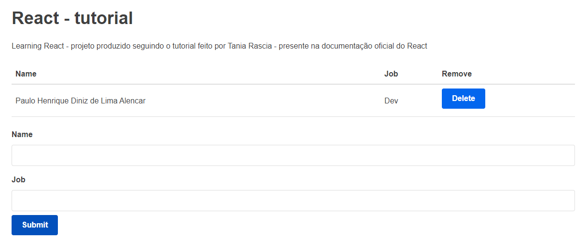

# React-tutorial
#### Cadastro e remoção de usuário

 Mine aplicação desenvolvida para aprender os conceitos introdutórios do React - desenvolvido seguindo o "Resumo do React por Tania Rascia" (presente na documentação oficial do React)



## Tech

- React
- JavaScript
- HTML5
- CSS3

## Installation

Necessita do [Node.js](https://nodejs.org/) v10+ para rodar

Você pode rodar o projeto:
```sh
cd react-tutorial
npm start
```

Rodando o app no development mode.\
Abra [http://localhost:3000](http://localhost:3000) para visualizar ele em seu browser.

## License

MIT

**Free Software**